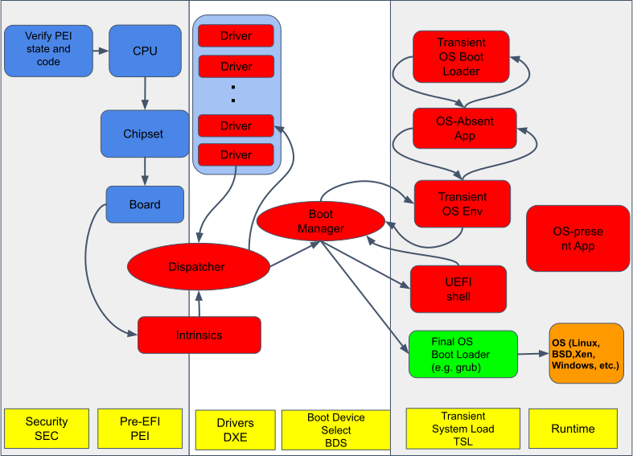
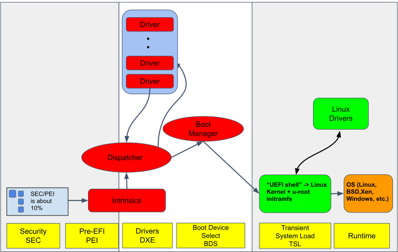
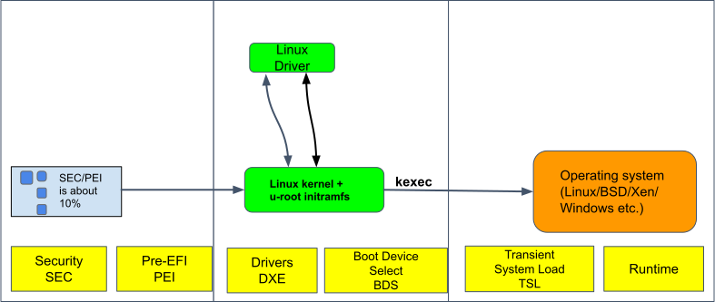

# The LinuxBoot project at Google

Google runs workloads across a number of clusters each with up to tens of
thousands of machines. Firmware runs on these machines when they first start
up. Google is pushing the state-of-the-art in many places including firmware.
The discussion here about Google's implementation of LinuxBoot is limited to
replacing specific UEFI [firmware](https://github.com/linuxboot/book/blob/master/intro/glossary/README.md) 
functionality with a Linux kernel and runtime. Over the years this project
has grown to include various initiatives with the overarching goal of moving
from obscure, complex firmware to simpler, open source firmware.

## Team

There have been a number of contributors to the Google LinuxBoot project
including:

-  Ron Minnich (technical lead)
-  Gan-shun Lim
-  Ryan O'Leary
-  Prachi Laud
-  Chris Koch
-  Xuan Chen
-  Andrew Sun

Ryan O'Leary is one of the Open Compute Platform Foundation
[Open System Firmware project](https://www.opencompute.org/projects/open-system-firmware) 
volunteer leads and Ron Minnich is the Open Compute Platform Foundation
Incubation Committee Representative.

## Goal

The primary goal of Google's LinuxBoot is to modernize the firmware by
simplifying it to technologies engineers understand and trust.
In UEFI systems, LinuxBoot consists of a "full stack" solution
of stripped-down UEFI firmware, a Linux kernel, and an initramfs with
tools written in Go. Although these components all make up one bundle
stored in ROM, there are three parts: the closed-source EFI firmware,
a Linux kernel, and [u-root](http://u-root.tk/). The Linux kernel is
an unmodified kernel.  The user-space initramfs image with Go tools
for system booting is available as u-root. Due to this modularity,
LinuxBoot can be used with a variety of systems. In many cases,
for example, the same kernel and initramfs have been used, without
recompilation, on both AMD and Intel x86 boards. The UEFI on
these boards is always specific to the board, however.

## Converting a UEFI firmware image to use LinuxBoot

The conversion to LinuxBoot starts with generic UEFI. A UEFI computer
boots in four main phases. The security phase (SEC) and the Pre-EFI
Initialization Stage (PEI) are responsible for low-level operations
to prepare the hardware and are usually specific to the hardware
they are implemented for. After these two stages, the Driver Execution
Environment (DXE) loads various drivers, and then the Boot Device Select
(BDS) phase begins.

It is not possible to modify the SEC and PEI stages, as their
components are tightly coupled to the chips on the board; even
small changes to the chips require new SEC and PEI stages.
LinuxBoot starts during the DXE stage, resulting in most of the drivers
(and their associated attack surface) not being loaded.
Instead, a Linux kernel is loaded as if it were a driver.
By loading during the DXE, LinuxBoot runs after the first two stages
of the UEFI, but takes over after that point, replacing the
UEFI drivers. It therefore completely replaces a large portion
of the boot process.

# Phases of the project

Google's LinuxBoot project is focused on moving UEFI boot functionality
into the kernel and userspace. That is, converting UEFI firmware
to run LinuxBoot. The project has taken the standard UEFI boot process
and converted it to LinuxBoot for production environments.
The steps to reach this goal are described below.

Step 1. Reduce or replace UEFI components

   UEFI contains proprietary, closed-source, vendor-supplied firmware
   drivers and firmware. LinuxBoot replaces many Driver Execution
   Environment (DXE) modules used by UEFI and other firmware,
   particularly the network stack and file system modules, with
   Linux applications.

   The following diagram shows the phases of the UEFI boot process.
   The items in red are components
   that are either reduced or eliminated with LinuxBoot.
   The dark blue items on the left
   cannot be changed.

In the real FLASH part, the SEC and PEI are actually only 10% of total,
so we reduce the size of those boxes in this and following diagrams.

Another part of the conversion process was to modify the UEFI boot
process to boot a LinuxBoot image as shown below.

Step 2. Delete or replace as many proprietary DXEs as required to make
   step 3 work. In most cases, none need to be removed.

Step 3. Replace the UEFI shell with a Linux kernel + u-root

When Linux boots it needs a root file system with utilities.
LinuxBoot provides a file system based on u-root standard
utilities written in Go.

Step 4. Through trial and error, continue to remove DXEs until you
   can't remove anymore.

   The DXEs are delivered as binary blobs. There are three ways
    to handle them:

   1. The most desirable is to remove them and let Linux drivers take
      over what they did. This works well for USB, network, disk,
      and other drivers, as well as network protocols and file
      systems. In fact we have resolved many system reliability
      and performance issues just by removing DXEs!

   1. The second way is to replace the DXE with an open source driver.
      This is less desirable, as the DXE environment is not as
      hardened as the Linux kernel environment.
   1. The final, least desired option, is to continue to use the DXE.
      This is required if the DXE contains proprietary code that
      "tweaks" chipset settings, for example, memory timing or
      other controls, and there is no chance of ever bringing
      them to open source.

Step 5. Replace closed source DXEs with open source

   If we can build a DXE from source, we can use `utk` to:
     *  Remove the proprietary one
     *  Replace it with one built from source

Step 6. Next steps: complete LinuxBoot

   LinuxBoot is currently in production, but the LinuxBoot project        development continues to provide an open-source solution that
     does the following:

     1. Brings up the Linux kernel as a DXE in flash ROM instead of the UEFI shell.
     1. Provides a Go based userland that can then bring up the kernel that you want to run on the machine.
     1. Enables writing traditional firmware applications such as bootloader, debugging, diagnosis, and error detection applications as cross-architecture and cross-platform portable Linux applications.

The complete LinuxBoot solution is shown in the following diagram.

