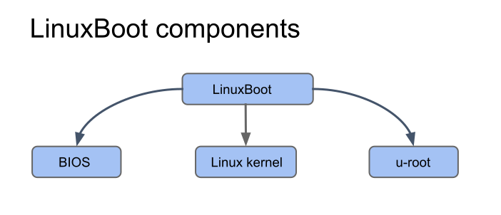

##

LinuxBoot consists of the following components:

1. BIOS
2. Linux kernel
3. u-root -> initramfs

#### BIOS

This does not have to be a specific BIOS; currently LinuxBoot supports UEFI
and [coreboot](https://coreboot.org/).

#### Linux kernel

LinuxBoot is not intended to be a runtime production kernel; rather, it
is meant to replace specific UEFI functionality using Linux kernel capabilities
and then boot the actual production kernel on the machine. Kernel
configuration files specific to LinuxBoot provide the needed Linux kernel
capabilities without bloating the size of the BIOS with unnecessary drivers.

These config files disable options that are not needed in the LinuxBoot
kernel and add some patches that are needed.

#### Initial RAM filesystem  (initramfs)

When Linux boots it needs a root file system that provides boot and startup
utilities. LinuxBoot uses [u-root](../glossary) to create an
initramfs for this purpose.

#### What is an initramfs?

The initramfs is a root file system that is embedded within the firmware
image itself. It is intended to be placed in a flash device along with the
Linux kernel as part of the firmware image for LinuxBoot. The initramfs is
essentially a set of directories bundled into a single cpio archive.

At boot time, the boot loader or firmware (for example, coreboot) loads
the bzImage and initramfs into memory and starts the kernel. The kernel
checks for the presence of the initramfs and, if found, unpacks it, mounts
it as `/` and runs `/init`.

There are many types of initramfs, in this topic we focus on u-root.
u-root is a Go userland (a set of programs and libraries written in Go that
are used to interact with the kernel). It contains a toolset of standard
Linux applications and commands.

u-root can create an initramfs in two different modes:

*   source mode, which contains:
    *   Go toolchain binaries
    *   A simple shell
    *   Go source for tools to be compiled on the fly by the shell
*   Busybox (bb) mode: This is one busybox-like binary comprising all the
    requested utilities.

The initramfs provided by u-root implements the toolchain needed to securely
boot the machine from the network, perform identity verification, communicate
with different internal boot-related components, and kexec the next kernel.

u-root is an open source project hosted on GitHub. Within the u-root
repository, we have executable commands in `cmds` and the packages containing
libraries and implementations in `pkg`.

