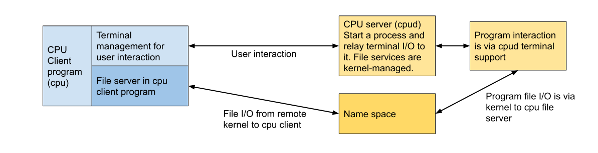

## The u-root `cpu` command

Do you want to have all the tools on your linuxboot system that you have on your
desktop, but you can't get them to fit in your tiny flash part? Do you want all
your desktop files visible on your linuxboot system, but just remembered there's
no disk on your linuxboot system? Are you tired of using `scp` or `wget` to move
files around? Do you want to run `emacs` or `vim` on the linuxboot machine, but
know they can't ever fit? What about `zsh`? How about being able to run commands
on your linuxboot machine and have the output appear on your home file system?
You say you'd like to make this all work without having to fill out web forms in
triplicate to get your organization to Do Magic to your desktop?

#### Your search is over: `cpu` is here to answer all your usability needs.


## The problem: running your program on some other system

People often need to run a command on a remote system. That is easy when the
remote system is the same as the system you are on, e.g., both systems are
Ubuntu 16.04; and all the libraries, packages, and files are roughly the same.
But what if the systems are different, say, Ubuntu 16.04 and Ubuntu 18.10? What
if one is Centos, the other Debian? What if a required package is missing on the
remote system, even though in all other ways they are the same?

While these systems are both Linux, and hence can provide Application Binary
Interface (ABI) stability at the system call boundary, above that boundary
stability vanishes. Even small variations between Ubuntu versions matter: symbol
versions in C libraries differ, files are moved, and so on.

What is a user to do if they want to build a binary on one system, and run it on
another system?

The simplest approach is to copy the source to that other system and compile it.
That works sometimes. But there are limits: copying the source might not be
allowed; the code might not even compile on the remote system; some support code
might not be available, as for a library; and for embedded systems, there might
not be a compiler on the remote system. Copy and compile is not always an
option. In fact it rarely works nowadays, when even different Linux
distributions are incompatible.

The next option is to use static linking. Static linking is the oldest form of
binary on Linux systems. While it has the downside of creating larger binaries,
in an age of efficient compilers that remove dead code, 100 gigabit networks,
and giant disks and memory, that penalty is not the problem it once was. The
growth in size of static binaries is nothing like the growth in efficiency and
scale of our resources. Nevertheless, static linking is frowned upon nowadays and
many libraries are only made available for dynamic linking.

Our user might use one of the many tools that package a binary and all its
libraries into a single file, to be executed elsewhere. The u-root project even
offers one such tool, called `pox`, for portable executables. `Pox` uses the
dynamic loader to figure out all the shared libraries a program uses, and place
them into the archive as well. Further, the user can specify additional files to
carry along in case they are needed.

The problem here is that, if our user cares about binary size, this option is
even worse. Deadcode removal won’t work; the whole shared library has to be
carried along. Nevertheless, this can work, in some cases.

So our user packages up their executable using `pox` or a similar tool, uses
`scp` to get it to the remote machine, logs in via `ssh`, and all seems to be
well, until at some point there is another message about a missing shared
library! How can this be? The program that packaged it up checked for all
possible shared libraries.

Unfortunately, shared libraries are now in the habit of loading other shared
libraries, as determined by reading text files. It’s no longer possible to know
what shared libraries are used; they can even change from one run of the program
to the next. One can not find them all just by reading the shared library
itself. A good example is the name service switch library, which uses
`/etc/nsswitch.conf` to find other shared libraries. If `nsswitch.conf` is
missing, or a library is missing, some versions of the name service switch
library will core dump.

Not only must our user remember to bring along `/etc/nsswitch.conf`, they must
also remember to bring along all the libraries it might use. This is also true
of other services such as Pluggable Authentication Modules (PAM). And,
further, the program they bring along might run other programs, with their own
dependencies. At some point, as the set of files grows, frustrated users might
decide to gather up all of `/etc/`, `/bin`, and other directories, in the hope
that a wide enough net might bring along all that’s needed. The remote system
will need lots of spare disk or memory! We’re right back where we started, with
too many files for too little space.

In the worst case, to properly run a binary from one system, on another system,
one must copy everything in the local file system to the remote system. That is
obviously difficult, and might be impossible if the remote system has no disk,
only memory.

One might propose having the remote system mount the local system via NFS or
Samba. While this was a common approach years ago, it comes with its own set of
problems: all the remote systems are now hostage to the reliability of the NFS
or Samba server. But there’s a bigger problem: there is still no guarantee that
the remote system is using the same library versions and files that the user’s
desktop is using. The NFS server might provide, e.g., Suse, to the remote
system; the user’s desktop might be running Ubuntu. If the user compiles on
their desktop, the binary might still not run on the remote system, as the Suse
libraries might be different. This is a common problem.

Still worse, with an NFS root, everyone can see everyone’s files. It’s like
living in an apartment building with glass walls. Glass houses only look good in
architecture magazines. People want privacy.

### We know what ssh provides; but what else do we need?

`Ssh` solves the problem of safely getting logged in to a remote machine. While
this is no small accomplishment, it is a lot like being parachuted into a
foreign land, where the rules are changed. It’s a lot nicer, when going to a new
place, to be able to bring along some survival gear, if not your whole house!

Users need a way to log in to a machine, in a way similar to `ssh`, but they
need to bring their environment with them. They need their login directory;
their standard commands; their configuration files; and they need some privacy.
Other users on the machine should not be able to see any of the things they
bring with them. After all, everyone who goes camping wants to believe they are
the only people at that campground!

### How `cpu` provides what we need

`cpu` is a Go-based implementation of Plan 9's `cpu` command. It uses the go
`ssh` package, so all your communications are as secure as `ssh`. It can be
started from `/sbin/init` or even replace `/sbin/init`, so you have a tiny flash
footprint. You can see the code at
[github.com:u-root/cpu](https://github.com/u-root/cpu). It's also small: less
than 20 files, including tests.

`cpu` runs as both a client (on your desktop) and an `ssh` server (on your
linuxboot machine). On your desktop, it needs no special privilege. On the
linuxboot system, there is only one binary needed: the `cpu` daemon (`cpud`). As
part of setting up a session, in addition to normal `ssh` operations, `cpu` sets
up private name space at important places like `/home/$USER`, `/bin, /usr,`and
so on. Nobody gets to see what other people’s files are.

`Ssh` provides remote access. `Cpu` goes one step further, providing what is
called _resource sharing_ -- resources, i.e., files from the client machine can
be used directly on the remote machine, without needing to manually copy them.
`Cpud` implements resource sharing by setting up a `file system`mount on the
remote machine and relaying file I/O requests back to the desktop `cpu` process.
The desktop command services those requests; you don't need to run a special
external server. One thing that is a bit confusing with `cpu`: the desktop
client is a file server; the remote server’s Linux kernel is a file client.
`Cpu` has to do a bit more work to accomplish its task.

`Cpu` will change your life. You can forget about moving files via `scp`: once
you '`cpu` in', the `/home` directory on your linuxboot node is your home
directory. You can `cd ~`and see all your files. You can pick any shell you
want, since the shell binary comes from your desktop, not flash. You don't have
to worry about fitting `zsh` into flash ever again!

At Google we can now run `chipsec`, which imports 20M of Python libraries,
because we have `cpu` and we can redirect `chipsec` output to files in our home
directory.

Here is an example session:

In this command, we `cpu` to a PC Engines APU2. We have built a kernel and
u-root initramfs containing just one daemon -- the `cpu` daemon -- into the
flash image. The APU2 does not even need a disk; it starts running as a “`cpu`
appliance.”

The `bash` is not on the `cpu` node; it will come from our desktop via the 9p
mount.

```
    rminnich@xcpu:~/gopath/src/github.com/u-root/u-root$ cpu apu2
    root@(none):/# 
    root@(none):/# ls ~ 
    IDAPROPASSWORD  go      ida-7.2  projects
    bin             gopath  papers   salishan2019random  snap
    root@(none):/# exit
```

The `bash` and `ls` command, and the shared libraries they need, do not exist on
the apu2; `cpu` makes sure that the client provides them to the `cpu` server.
The home directory is, similarly, made available to the remote machine from the
local machine.

A big benefit of `cpu` is that, as long as the network works, users can create
very minimal flash images, containing just the `cpu` daemon, just enough to get
the network going. Once the network is up, users can `'cpu` in', and everything
they need is there. It actually looks like they are still logged in to their
desktop, except, of course, truly local file systems such as `/proc` and `/sys`
will come from the machine they are on, not their desktop.

# An easy overview of how `cpu` works

`Cpu`, as mentioned, consists of a client and a server. The client is on your
desktop (or laptop), and the server is on the remote system. Both client and
server use an `ssh` transport, meaning that the “wire” protocol is `ssh`. In
this way, `cpu` is just like `ssh`.

As mentioned above, the situation for `cpu` is a bit more complicated than for
`ssh`. `Cpu` provides resource sharing, but not from the server to the client,
but rather from the client to the server. The `cpu` client is a file server; the
`cpu` server connects the kernel on the server machine to the file server in the
client, as shown below. Things to note:

1.  `Cpud`, on the remote or server machine, sets up a “private name space
    mount” of `/tmp` for the program. “Private name space mount” just means that
    only that program, and its children, can see what is in its private `/tmp`.
    Other, external programs continue to use `/tmp`, but they are _different_
    instantiations of `/tmp`.
2.  The private name space mount of `/tmp` is on a filesystem in RAM. The data
    stored in `/tmp` is not visible to other processes, and not persistent.
3.  `cpud` creates a directory, `cpu`, in the private `/tmp`; and mounts the
    server on it. This mount point is also invisible outside the process and its
    children.
4.  To make sure that names like `/bin/bash`, and `/usr/lib/libc.so` work,
    `cpud` sets up _bind mounts_ from, e.g., `/tmp/cpu/bin` to `/bin`. These are
    also private mounts, and do not affect any program outside the one `cpud`
    starts. Anytime the program and its children access files in `/bin`, `/lib`,
    `/usr`, `/home/$USER`, and so on, they are accessing files from the client
    machine via the built-in client file server.
5.  The client `cpu` program passes the full environment from the client machine
    to `cpud`. When the client program requests that, e.g., `bash` be run, the
    `cpud` uses the PATH environment variable to locate `bash`. Because of the
    private name space mounts and binds, `bash` will be found in `/bin/bash`,
    and its libraries will be found in their usual place. This is an essential
    property of `cpu`, that the names used on the user’s machine work the same
    way on the remote machine. An overview of the process is shown below.


### `Cpu` startup

The startup proceeds in several steps. Every session begins with an initial
contact from the `cpu` client to the `cpu` server.


The first step the `cpud` does is set up the mounts back to the client. It then
sets up the bind mounts such as `/bin` to `/tmp/cpu/bin`. In the following
figure, we compress the Linux kernel mount and bind mounts shown above into a
smaller box called “name space.”


Next, `cpu` and the `cpud` set up the terminal management.


Finally, `cpud` sets up the program to run. Because the PATH variable has been
transferred to `cpud`, and the name space includes `/bin` and `/lib`, the `cpud`
can do a standard Linux `exec` system call without having to locate where
everything is. Native kernel mechanisms create requests as files are referenced,
and the `cpu` file server support does the rest.



Why do we only show one program instead of many? From the point of view of
`cpud`, it only starts one program. From the point of view of users, there can
be many. But if there is more than one program to start, <em>that is not the
responsibility of <code>cpud</code></em>. If more than one program is run, they
will be started by the program that <code>cpud</code> started, i.e., a command
interpreter like the shell. Or it could be as simple as a one-off command like
<code>date</code>. From the point of view of <code>cpud</code>, it’s all the
same. <code>Cpud</code> will wait until the process it started, and all its
children, have exited. But <code>cpud</code>’s responsibilities to start a
program ends with that first program.

But what happens when `cpud` runs that first program? Here is where it gets
interesting, and, depending on your point of view, either magical, confounding,
or counterintuitive. We’ll go with magical.

## Starting that first program

As mentioned above, `cpud` sets up mounts for a name space, and calls the Linux
`exec()` call to start the program.

We can actually watch all the `cpu` file server operations. The file server
protocol is called 9P2000. We are going to present a filtered version of the
file I/O from running a remote `date`; in practice, you can watch all the opens,
reads, writes, and closes the remote process performs.

The trace for running `date` starts right when the remote program has called
`exec`, and the kernel is starting to find the program to run[^1]. The file
opens look like this, on a user’s system:

```
Open /bin/date
Open /lib/x86_64-linux-gnu/ld-2.27.so
Open /etc/ld.so.cache
Open /lib/x86_64-linux-gnu/libc-2.27.so
Open /usr/lib/locale/locale-archive
Open /usr/share/zoneinfo/America/Los_Angeles
```

The kernel opened `/bin/date`, determined what libraries (files ending in `.so`)
it needed, and opened them as well.

We can compare this with a local execution:


```
execve "/bin/date"
access "/etc/ld.so.nohwcap"
access "/etc/ld.so.preload"
openat "/etc/ld.so.cache"
access "/etc/ld.so.nohwcap"
openat "/lib/x86_64-linux-gnu/libc.so.6"
openat "/usr/lib/locale/locale-archive"
openat "/etc/localtime"
```

Note that several files do not show up in our trace; they are in `/etc`, and the
`cpud` does not set up a bind mount over `/etc`. But the other files look very
similar. You might wonder why the local version opens `/etc/localtime`, and the
remote version opens `/usr/share/zoneinfo/America/Los_Angeles`.

The reason is that `etc/localtime` is a symlink:


```
lrwxrwxrwx 1 root root 39 May 29 12:47 /etc/localtime -> /usr/share/zoneinfo/America/Los_Angeles
```

The access to `/etc/localtime` does not get handled by the server; but the
access to `/usr/share/zoneinfo/America/Los_Angeles`does.

What about different architectures? What if we are using an x86 but want to
`cpu` to an ARM processor?

We can set the local `cpu` up to talk to a remote `cpu` that needs different
binaries. We might have an entire ARM file system tree in `~/arm`, for example.
We would then invoke `cpu` as follows:

```
cpu -root ~/arm date
```

And the remote `cpud`, running on an ARM, would be provided with ARM binaries.

## Learning how to use `cpu`

`Cpu` can be a hard thing to learn, not because it is difficult, but because it
is different. To paraphrase Yoda, you have to unlearn what you have learned.
Forget about copying files from here to there; when you `cpu` there, it looks
like your files are waiting for you.

You can start experimenting and learning about `cpu` by just running it locally.

### A set of binaries for you to try

In order for you to try it out, start by working with the set of `cpu` binaries
at
[https://github.com/u-root/cpubinaries](https://github.com/u-root/cpubinaries).
With them, you can create a bootable, mountable USB image that you can download.
The image contains a `cpu` client that runs on Linux, a private key, and, when
booted, it starts a `cpu` daemon and waits to serve `cpu` clients. The `cpu`
client is statically linked and hence should run on any Linux from the last 10
years or so.

The binaries include:

*   A kernel (`cpukernel`) with a built-in initramfs containing `cpud`, as well
    as a public key. Also included, should you want to build your own, is the
    config file (`cpu.config`).
*   A binary client program, `cpu`, as well as the private key to use. You can
    place this key in `~/.ssh` or specify it via the `-key` option to `cpu`.
*   A script to run the USB stick via `qemu` (`TESTQEMU`); and a script to run a
    `cpu` command (`EXAMPLE`).
*   The `extlinux.conf` used for the USB stick.

`usbstick.xz` is a compressed USB stick image that is bootable. It will
uncompress to about 7GB. You can use the `TESTQEMU` script to try it out, or use
`dd` to write it to a USB stick and boot that stick on an x86 system.

Be careful how you use the keys; they're public. You should really only use them
as part of the demo.

The `cpukernel` was built using the `github.com:linuxboot/mainboards` repo. If
you clone this repo, the following commands will rebuild the kernel:

*   `cd mainboards/intel/generic`
*   `make fetch`
*   `make cpukernel`

### How to use the cpu binaries

You’ll first need to start the server, and we show the entire sequence below,
including unpacking the image:

```
xz -d usbstick.xz
```

How you run `qemu` depends on whether you want graphics or not: if you are not
in a windowing environment, add `-nographic` to the command below. In any event,
at the `boot:` prompt, you can hit return or wait:

```
bash QEMU -hda usbstick

SeaBIOS (version 1.13.0-1)
iPXE (http://ipxe.org) 00:03.0 CA00 PCI2.10 PnP PMM+3FF90750+3FED0750 CA00
                                                                           Booting from Hard Disk...
SYSLINUX 6.03 EDD 20171017 Copyright (C) 1994-2014 H. Peter Anvin et al
boot:
.
.
.
Freeing unused kernel image (rodata/data gap) memory: 568K
rodata_test: all tests were successful
Run /init as init process
```


At this point, the `cpu` daemon is running, and you can try the `cpu` command:


```
rminnich@minnich:/home/cpubinaries$ ./cpu -key cpu_rsa localhost date
Fri 16 Oct 2020 04:21:04 PM PDT
```


You can log in and notice that things are the same:

**rminnich@minnich**:**/home/cpubinaries**$ ./cpu -key cpu_rsa localhost

root@192:/home/cpubinaries# ls

**cpu** cpukernel cpu_rsa.pub **extlinux.conf** **QEMU** usbstick

cpu.config  cpu_rsa    EXAMPLE      LICENSE        README.md

root@192:/home/cpubinaries#

Note that you end up in the same directory on the remote node that you are in on
the host; all the files are there. We can run any program on the remote node
that we have on the host:

```
root@192:/home/cpubinaries# which date
/usr/bin/date
root@192:/home/cpubinaries# date
Fri 16 Oct 2020 04:25:01 PM PDT
root@192:/home/cpubinaries# ldd /usr/bin/date
mount
	linux-vdso.so.1 (0x00007ffd83784000)
	libc.so.6 => /lib/x86_64-linux-gnu/libc.so.6 (0x00007efdb93db000)
	/lib64/ld-linux-x86-64.so.2 (0x00007efdb95e4000)
root@192:/home/cpubinaries# mount
...
cpu on /tmp type tmpfs (rw,relatime)
127.0.0.1 on /tmp/cpu type 9p (rw,nosuid,nodev,relatime,sync,dirsync,uname=rminnich,access=client,msize=65536,trans=fd,rfd=9,wfd=9)
rootfs on /tmp/local type rootfs (rw,size=506712k,nr_inodes=126678)
127.0.0.1 on /lib type 9p (rw,nosuid,nodev,relatime,sync,dirsync,uname=rminnich,access=client,msize=65536,trans=fd,rfd=9,wfd=9)
127.0.0.1 on /lib64 type 9p (rw,nosuid,nodev,relatime,sync,dirsync,uname=rminnich,access=client,msize=65536,trans=fd,rfd=9,wfd=9)
127.0.0.1 on /usr type 9p (rw,nosuid,nodev,relatime,sync,dirsync,uname=rminnich,access=client,msize=65536,trans=fd,rfd=9,wfd=9)
127.0.0.1 on /bin type 9p (rw,nosuid,nodev,relatime,sync,dirsync,uname=rminnich,access=client,msize=65536,trans=fd,rfd=9,wfd=9)
127.0.0.1 on /etc type 9p (rw,nosuid,nodev,relatime,sync,dirsync,uname=rminnich,access=client,msize=65536,trans=fd,rfd=9,wfd=9)
127.0.0.1 on /home type 9p (rw,nosuid,nodev,relatime,sync,dirsync,uname=rminnich,access=client,msize=65536,trans=fd,rfd=9,wfd=9)
root@192:/home/cpubinaries# 
```

As you can see, `/tmp/cpu` is mounted via 9p back to the `cpu` client (recall
that the `cpu` client is a 9p server, so your files are visible on the remote
node). Further, you can see mounts on `/usr`, `/bin`, `/etc`, and so on. For
this reason, we can run `date` and it will find its needed libraries in `/usr`,
as the `ldd` command demonstrates.

### Making cpu easier to use

If you get tired of typing `-keys`, do the following: put your own `cpu_rsa` in
`~/.ssh`; and copy the `cpu` binary to `bin` (or build a new one).

Warning! The `cpu` keys we provide in the repo are only to be used for this
demo. You should not use them for any other purpose, as they are in a github
repo and hence open to the world.

### What if you don’t want all the name space?

Sometimes, you don’t want all the `/usr` and `/bin` directories to be replaced
with those from your machine. You might, for example, `cpu` into an ARM system,
and hence only need a `/home`, but nothing else.

The -namespace switch lets you control
the namespace. It is structured somewhat like a path variable, with :-seperated
components. The default value is ```/lib:/lib64:/usr:/bin:/etc:/home```. You can
modify it or even force it to be empty: ```-namespace=""```, for example.
If it is empty, cpud will only mount the 9p server on /tmp/cpu.

This following example will cpu to an ARM64 host, sharing /home, but nothing else.

```
cpu arm -namespace=/home /bin/date
```

For an different architecture system, we might want to specify that the /bin, /lib,
and other directories have a different path on the remote than they have locally.
The -namespace switch allows this via an = sign:

```
cpu -namespace /lib:/lib64:/usr:/bin:/etc:/home arm /bin/date
```

In this case, /bin, /usr, and /lib on the remote system are supplied by /arm/bin,
/arm/lib, and /arm/usr locally.

If we need to test cpu without doing bind mounts, we can specify a PWD that requires
no mounts and an empty namespace:
```
PWD=/ cpu -namespace="" -9p=false h /bin/ls
bbin
bin
buildbin
dev
env
etc
go
home
init
...
```

There is a bit of a subtlety about the interaction of the namespace and 9p switches,
which we are still discussing: the -namespace value can override the -9p switch.

If you set -9p=false but have a non-empty namespace variable, then 9p will be set to
true. So in this example, the -9p switch has no effect:
```
cpu -9p=false h ls
```
Why is this? Because the default value of -namespace is non-empty.
The open question: should -9p=false force the namespace to be empty;
or should a none-empty namespace for -9p to be true? For now, we have chosen
the latter approach.

Another possible approach is to log conflicting settings of these two switches
and exit:
```
cpu -9p=false h ls
error: 9p is false but the namespace is non-empty; to force an empty namespace use -namespace=""
```
We welcome comments on this issue.

### cpu and Docker

Maintaining file system images is inconvenient.
We can use Docker containers on remote hosts instead.
We can take a standard Docker container and, with suitable options, use docker
to start the container with cpu as the first program it runs.

That means we can use any Docker image, on any architecture, at any time; and
we can even run more than one at a time, since the namespaces are private.

In this example, we are starting a standard Ubuntu image:
```
docker run -v /home/rminnich:/home/rminnich -v /home/rminnich/.ssh:/root/.ssh -v /etc/hosts:/etc/hosts --entrypoint /home/rminnich/go/bin/cpu -it ubuntu@sha256:073e060cec31fed4a86fcd45ad6f80b1f135109ac2c0b57272f01909c9626486 h
Unable to find image 'ubuntu@sha256:073e060cec31fed4a86fcd45ad6f80b1f135109ac2c0b57272f01909c9626486' locally
docker.io/library/ubuntu@sha256:073e060cec31fed4a86fcd45ad6f80b1f135109ac2c0b57272f01909c9626486: Pulling from library/ubuntu
a9ca93140713: Pull complete
Digest: sha256:073e060cec31fed4a86fcd45ad6f80b1f135109ac2c0b57272f01909c9626486
Status: Downloaded newer image for ubuntu@sha256:073e060cec31fed4a86fcd45ad6f80b1f135109ac2c0b57272f01909c9626486
WARNING: The requested image's platform (linux/arm64/v8) does not match the detected host platform (linux/amd64) and no specific platform was requested
1970/01/01 21:37:32 CPUD:Warning: mounting /tmp/cpu/lib64 on /lib64 failed: no such file or directory
# ls
bbin  buildbin	env  go    init     lib    proc  tcz  ubin  var
bin   dev	etc  home  key.pub  lib64  sys	 tmp  usr
#
```

Note that the image was update and then started. The /lib64 mount fails, because there is no /lib64 directory in the image, but
that is harmless.

On the local host, on which we ran docker, this image will show up in docker ps:
```
rminnich@a300:~$ docker ps
CONTAINER ID   IMAGE     COMMAND                  CREATED         STATUS         PORTS     NAMES
b92a3576229b   ubuntu    "/home/rminnich/go/b…"   9 seconds ago   Up 9 seconds             inspiring_mcnulty
````

Even though the binaries themselves are running on the remote ARM system.

### cpu and virtiofs

While 9p is very general, because it is *transport-independent*, there are cases where we can get much better performance by using a less general
file system.
One such case is with virtofs.

Because virtiofs is purely from guest kernel vfs to host kernel vfs, via virtio transport, it has been measured to run at up to 100 times faster.

We can use virtiofs by specifying virtiofs mounts. The cpud will look for an environemnt variable, CPU_FSTAB, which is in fstab(5) format. The client
can specify an fstab in one of two ways:
o via the -fstab switch, in which case the client will populate the CPU_FSTAB variable with the contents of the file
o by passing the CPU_FSTAB environment variable, which happens by default

On the client side, the file specified via the -fstab takes precedence over any value of the CPU_FSTAB environment variable. On the server side,
cpud does not use the -fstab switch, only using the environment variable.

Here is an example of using the CPU_FSTAB variable with one entry:
```
CPU_FSTAB="myfs /mnt virtiofs rw 0 0" cpu v
```
In this case, the virtiofs server had the name myfs, and on the remote side, virtiofs was mounted on /mnt.

For the fstab case, the command looks like this:
```
cpu -fstab fstab v
```
The fstab in this case would be
```
myfs /mnt virtiofs rw 0 0
```

Note that both the environment variable and the fstab can have more than one entry, but they entries must be separate by newlines. Hence, this will
not work:
```
CPU_FSTAB=`cat fstab` cpu v
```
as shells insist on converting newlines to spaces.

The fstab can specify any file system. If there is a mount path to, e.g., Google drive, and it can be specified
in fstab format, then cpu clients can use Google Drive files. Note, again, that these alternative mounts do not use the 9p server built in to
the cpu client; they use the file systems provided on the cpu server machine.

There are thus several choices for setting up the mounts
* 9p support by the cpu client
* 9p supported by the cpu client, with additional mounts via -fstab or -namespace
* 9p *without* any bind mounts, i.e. -9p=false -namespace "", in which case, on the remote machine, files from the client are visible in /tmp/cpu, but no bind mounts are done;
  with additional mounts provided by fstab
  mounts are provided
* no 9p mounts at all, when -namespace="" -9p=false; with optional additional mounts via fstab
* if there are no 9p mounts, and no fstab mounts, cpu is equivalent to ssh.

<!-- Footnotes themselves at the bottom. -->
## Notes

[^1]: For reference, the command we used: `cpu -dbg9p -d apu2 date`

