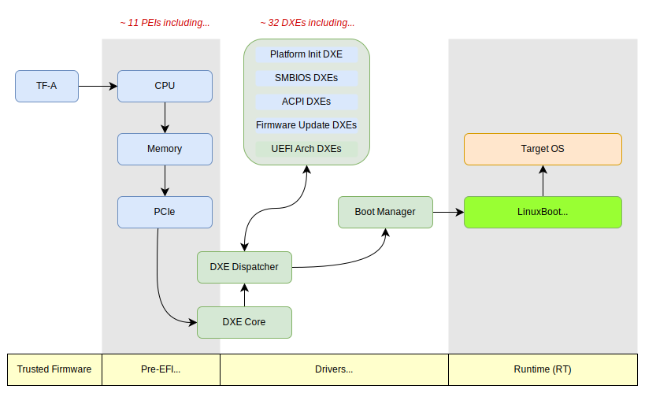

# LinuxBoot on Ampere Mt. Jade Platform

The Ampere Altra Family processor based Mt. Jade platform is a high-performance
ARM server platform, offering up to 256 processor cores in a dual socket configuration.
The Tianocore EDK2 firmware for the Mt. Jade platform has been fully upstreamed to
the tianocore/edk2-platforms repository, enabling the community to build and experiment
with the platform's firmware using entirely open-source code. It also supports LinuxBoot,
an open-source firmware framework that reduces boot time, enhances security,
and increases flexibility compared to standard UEFI firmware.

Mt. Jade has also achieved a significant milestone by becoming
[the first server certified under the Arm SystemReady LS certification program](https://community.arm.com/arm-community-blogs/b/architectures-and-processors-blog/posts/arm-systemready-ls).
SystemReady LS ensures compliance with standardized boot and runtime environments
for Linux-based systems, enabling seamless deployment across diverse hardware.
This certification further emphasizes Mt. Jade's readiness for enterprise and
cloud-scale adoption by providing assurance of compatibility, performance, and reliability.

This case study explores the LinuxBoot implementation on the Ampere Mt. Jade platform,
inspired by the approach used in [Google's LinuxBoot deployment](Google_study.md).

## Ampere EDK2-LinuxBoot Components

The Mt. Jade platform embraces a hybrid firmware architecture, combining UEFI/EDK2 for
hardware initialization and LinuxBoot for advanced boot functionalities. The platform
aligns closely with step 6 in the LinuxBoot adoption model.



The entire boot firmware stack for the Mt. Jade is open source and available in the Github.

* **EDK2**: The PEI and minimal (stripped-down) DXE drivers, including both common and
platform code, are fully open source and resides in Tianocore edk2-platforms and edk2 repositories.
* **LinuxBoot**: The LinuxBoot binary (flashkernel) for Mt. Jade is supported in the
[linuxboot/linuxboot](https://github.com/linuxboot/linuxboot/tree/main/mainboards/ampere/jade) repository.

## Ampere Solution for LinuxBoot as a Boot Device Selection

Ampere has implemented and successfully upstreamed a solution for integrating LinuxBoot
as a Boot Device Selection (BDS) option into the TianoCore EDK2 framework, as seen in
commit
[ArmPkg: Implement PlatformBootManagerLib for LinuxBoot](https://github.com/tianocore/edk2/commit/62540372230ecb5318a9c8a40580a14beeb9ded0).
This innovation simplifies the boot process for the Mt. Jade platform and aligns with
LinuxBoot's goals of efficiency and flexibility.

Unlike the earlier practice that replaced the UEFI Shell with a LinuxBoot flashkernel,
Ampere's solution introduces a custom BDS implementation that directly boots into the
LinuxBoot environment as the active boot option. This approach bypasses the need to load
the UEFI Shell or UiApp (UEFI Setup Menu), which depend on numerous unnecessary DXE
drivers.

To further enhance flexibility, Ampere introduced a new GUID specifically for the
LinuxBoot binary, ensuring clear separation from the UEFI Shell GUID. This distinction
allows precise identification of LinuxBoot components in the firmware.

## Build Process

Building a flashable EDK2 firmware image with an integrated LinuxBoot flashkernel for the
Ampere Mt. Jade platform involves two main steps: building the LinuxBoot flashkernel and
integrating it into the EDK2 firmware build.

### Step 1: Build the LinuxBoot Flashkernel

The LinuxBoot flash kernel is built as follows:

```bash
git clone https://github.com/linuxboot/linuxboot.git
cd linuxboot/mainboards/ampere/jade && make fetch flashkernel
```

After the build process completes, the flash kernel will be located at:
linuxboot/mainboards/ampere/jade/flashkernel

### Step 2: Build the EDK2 Firmware Image with the Flash Kernel

The EDK2 firmware image is built with the LinuxBoot flashkernel integrated into the flash
image using the following steps:

```bash
git clone https://github.com/tianocore/edk2-platforms.git
git clone https://github.com/tianocore/edk2.git
git clone https://github.com/tianocore/edk2-non-osi.git
./edk2-platforms/Platform/Ampere/buildfw.sh -b RELEASE -t GCC -p Jade -l linuxboot/mainboards/ampere/jade/flashkernel
```

The `buildfw.sh` script automatically integrates the LinuxBoot flash kernel
(provided via the -l option) as part of the final EDK2 firmware image.

This process generates a flashable EDK2 firmware image with embedded LinuxBoot, ready for
deployment on the Ampere Mt. Jade platform.

## Booting with LinuxBoot

When powered on, the system will boot into the u-root and automatically kexec to the target OS.

```
Run /init as init process
1970/01/01 00:00:10 Welcome to u-root!
                              _
   _   _      _ __ ___   ___ | |_
  | | | |____| '__/ _ \ / _ \| __|
  | |_| |____| | | (_) | (_) | |_
   \__,_|    |_|  \___/ \___/ \__|

cgroup: Unknown subsys name 'perf_event'
init: 1970/01/01 00:00:10 Deprecation warning: use UROOT_NOHWRNG=1 on kernel cmdline instead of uroot.nohwrng
1970/01/01 00:00:10 Booting from the following block devices: [BlockDevice(name=nvme0n1, fs_uuid=) BlockDevice(name=nvme0n1p1, fs_uuid=d6c6-6306) BlockDevice(name=nvme0n1p2, fs_uuid=63402158-6266-48fb-b602-5f83f26bd0b9) BlockDevice(name=nvme0n1p3, fs_uuid=) BlockDevice(name=nvme1n1, fs_uuid=) BlockDevice(name=nvme1n1p1, fs_uuid=525c-92fb)]
1970/01/01 00:00:10 [grub] Got config file file:///tmp/u-root-mounts3457412855/nvme0n1p1/EFI/ubuntu/grub.cfg:
search.fs_uuid 63402158-6266-48fb-b602-5f83f26bd0b9 root
set prefix=($root)'/grub'
configfile $prefix/grub.cfg

1970/01/01 00:00:10 Warning: Grub parser could not parse ["search" "--fs-uuid" "63402158-6266-48fb-b602-5f83f26bd0b9" "root"]
1970/01/01 00:00:10 [grub] Got config file file:///tmp/u-root-mounts3457412855/nvme0n1p2/grub/grub.cfg
1970/01/01 00:00:10 Error: Expected 1 device with UUID "1334d6c5-c16f-46ba-9120-5127ae43bf63", found 0
1970/01/01 00:00:10 Error: Expected 1 device with UUID "1334d6c5-c16f-46ba-9120-5127ae43bf63", found 0


Welcome to LinuxBoot's Menu

Enter a number to boot a kernel:

1.  Ubuntu

2.  Ubuntu, with Linux 6.8.0-49-generic

3.  Ubuntu, with Linux 6.8.0-49-generic (recovery mode)

4.  Ubuntu, with Linux 6.8.0-48-generic

5.  Ubuntu, with Linux 6.8.0-48-generic (recovery mode)

6.  Reboot

7.  Enter a LinuxBoot shell


Enter an option ('01' is the default, 'e' to edit kernel cmdline):
 > 07

> dmidecode -t 4
# dmidecode-go
Reading SMBIOS/DMI data from sysfs.
SMBIOS 3.3.0 present.

Handle 0x0003, DMI type 4, 51 bytes
Processor Information
        Socket Designation: CPU01
        Type: Central Processor
        Family: ARMv8
        Manufacturer: Ampere(R)
        ID: 01 00 16 0A A1 00 00 00
        Signature: Implementor 0x0a, Variant 0x1, Architecture 6, Part 0x000, Revision 1
        Version: Ampere(R) Altra(R) Processor
        Voltage: 1.0 V
        External Clock: 25 MHz
        Max Speed: 3000 MHz
        Current Speed: 3000 MHz
        Status: Populated, Enabled
        Upgrade: Unknown
        L1 Cache Handle: 0x0001
        L2 Cache Handle: 0x0002
        L3 Cache Handle: Not Provided
        Serial Number: 000000000000000002550904033865B4
        Asset Tag: Not Set
        Part Number: Q80-30
        Core Count: 80
        Core Enabled: 80
        Thread Count: 80
        Characteristics:
                64-bit capable
                Multi-Core
                Execute Protection
                Enhanced Virtualization
                Power/Performance Control

Handle 0x0007, DMI type 4, 51 bytes
Processor Information
        Socket Designation: CPU02
        Type: Central Processor
        Family: ARMv8
        Manufacturer: Ampere(R)
        ID: 01 00 16 0A A1 00 00 00
        Signature: Implementor 0x0a, Variant 0x1, Architecture 6, Part 0x000, Revision 1
        Version: Ampere(R) Altra(R) Processor
        Voltage: 1.0 V
        External Clock: 25 MHz
        Max Speed: 3000 MHz
        Current Speed: 3000 MHz
        Status: Populated, Enabled
        Upgrade: Unknown
        L1 Cache Handle: 0x0005
        L2 Cache Handle: 0x0006
        L3 Cache Handle: Not Provided
        Serial Number: 000000000000000002560909033865B4
        Asset Tag: Not Set
        Part Number: Q80-30
        Core Count: 80
        Core Enabled: 80
        Thread Count: 80
        Characteristics:
                64-bit capable
                Multi-Core
                Execute Protection
                Enhanced Virtualization
                Power/Performance Control

>
M-? toggle key help • C-d erase/stop • C-c clear/cancel • C-r search hist …
```

## Future Work

While the LinuxBoot implementation on the Ampere Mt. Jade platform represents a significant
milestone, several advanced features and improvements remain to be explored.
These enhancements would extend the platform's capabilities, improve its usability,
and reinforce its position as a leading open source firmware solution.
Key areas for future development include:

* **Secure Boot with LinuxBoot**: One of the critical areas for future development
is enabling secure boot verification for the target operating system. In the LinuxBoot
environment, the target OS is typically booted using kexec. However, it is unclear
how Secure Boot operates in this context, as kexec bypasses traditional
firmware-controlled secure boot mechanisms. Future work should investigate how to
extend Secure Boot principles to kexec, ensuring that the OS kernel and its components
are verified and authenticated before execution. This may involve implementing
signature checks and utilizing trusted certificate chains directly within the
LinuxBoot environment to mimic the functionality of UEFI Secure Boot during the
kexec process.
* **TPM Support**: The platform supports TPM, but its integration with LinuxBoot
is yet to be defined. Future work could explore utilizing the TPM for secure boot
measurements, and system integrity attestation.
* **Expanding Support for Additional Ampere Platforms**: Building on the success
of LinuxBoot on Mt. Jade, future efforts should expand support to other Ampere platforms.
This would ensure broader adoption and usability across different hardware configurations.
* **Optimizing the Transistion Between UEFI and LinuxBoot**: Improving the efficiency
of the handoff between UEFI and LinuxBoot could further reduce boot times.
This optimization would involve refining the initialization process and minimizing
redundant operations during the handoff.
* **Advanced Diagnostics and Monitoring Tools**: Adding more diagnostic and monitoring
tools to the LinuxBoot u-root environment would enhance debugging and system management.
These tools could provide deeper insights into system performance and potential issues,
improving reliability and maintainability.

## See Also

* [LinuxBoot on Ampere Platforms: A new (old) approach to firmware](https://amperecomputing.com/blogs/linuxboot-on-ampere-platforms--a-new-old-approach-to-firmware)
