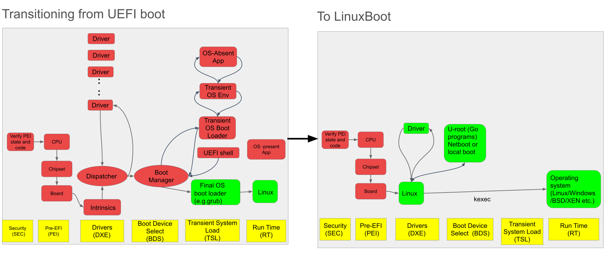

# LinuxBoot Introduction

This is the official “LinuxBoot Book” for the LinuxBoot project. The book:

* Describes the LinuxBoot project
* Explains why you would want to use LinuxBoot
* Describes the components that comprise LinuxBoot
* Highlights the differences between other boot processes and LinuxBoot
* Guides you through the steps needed to implement LinuxBoot

## What is LinuxBoot?

LinuxBoot is the idea of replacing proprietary or corporate-driven late-stage
boot [firmware](./glossary.md) with the Linux kernel and a community-based
user-space. That idea grew into a project that over the years includes various
initiatives with the overarching goal of moving from obscure and complex
firmware to simpler and open source firmware.

The LinuxBoot project provides two reference implementations; `linuxboot` and
Heads. The [`linuxboot`](https://github.com/linuxboot/linuxboot) build system
outputs a boot payload consisting of a Linux kernel and an
[initramfs](https://de.wikipedia.org/wiki/Initramfs) that contains a minimal
Go user-space built using [u-root](https://github.com/u-root/u-root).

The Heads build system is more focused on local attestation, TPM DUK
seal/unseal operations, GPG-based security measurement, reproducible builds and
uses BusyBox to provide a much larger suite of Linux tools allowing it to also
be used as a recovery environment.

Many other implementations exist independently of the project:

- [petitboot](https://github.com/open-power/petitboot) under the OpenPOWER
  project originally targeting the PS3
- [k-boot](https://github.com/BayLibre/k-boot) developed by BayLibre in 2023
  using BusyBox
- [nmbl](https://github.com/rhboot/nmbl-poc) developed by RedHat in 2024
- [ZFSBootMenu](https://docs.zfsbootmenu.org/en/latest)

And there is a long history of similar implementations including projects that
are no longer maintained:

- MILO on Alpha started before 2000 (see [What is
  MILO?](https://tldp.org/HOWTO/MILO-HOWTO/what-section.html))
- kboot developed by Werner Almesberger in 2005

These projects all attempt to reduce the role of firmware to a small,
fixed-function core whose only purpose is to get a flash-based Linux kernel
started. This “bare essentials” firmware prepares the hardware and starts a
Linux kernel and a user-space environment will run on the machine. Go is the
recommended user-space environment, but is not required.

## Why LinuxBoot is needed

Sometimes firmware contains drivers and utilities. They can have bugs, or be
unmaintained, which can be a source of problems and security issues. LinuxBoot
replaces proprietary, closed-source, vendor-supplied firmware drivers with
Linux drivers. This enables engineers writing Linux drivers and engineers
writing firmware drivers to focus on one set of drivers. Those drivers will, as
a result, have a larger set of contributors and reviewers, and because the
drivers are part of Linux, standard industry coding infrastructure can be used
to improve them. Finally, because these Linux drivers are currently being run
around the clock at scale, they will have fewer bugs.

## What LinuxBoot does

LinuxBoot replaces many Driver Execution Environment (DXE) modules used by
Unified Extensible Firmware Interface (UEFI) and other firmware, particularly
the network stack and file system modules, with Linux applications.

LinuxBoot brings up the Linux kernel as a DXE in flash ROM instead of the UEFI
shell. The Linux kernel, with a provided Go based user-space, can then load the
runtime kernel. The LinuxBoot paradigm enables writing traditional firmware
applications such as boot loader, debugging, diagnosis, and error detection
applications as cross-architecture and cross-platform portable Linux
applications.

When Linux boots it needs a root file system with utilities. One such root
filesystem used for LinuxBoot is based on u-root standard utilities written in
Go. The following diagram shows the current state of the UEFI boot process and
what is planned for the transition to LinuxBoot.

## Benefits of using the Go user-space environment and compiler

Go is a systems programming language created by Google. Go has strong typing,
language level support for concurrency, inter-process communication via
channels, runtime type safety and other protective measures, dynamic allocation
and garbage collection, and closures. Go has a package name notation similar to
Java that makes it clear to determine what packages a given program needs.

The modern language constructs make Go a much safer language than C. This
safety is critical for network-attached embedded systems, which usually have
network utilities written in C, including web servers, network servers
including `sshd`, and programs that provide access to a command interpreter,
itself written in C. All are proving to be vulnerable to the attack-rich
environment that the Internet has become.

Even the most skilled programmers can make mistakes that in C can be
unrecoverable, especially on network connected systems. Currently, even the
lowest-level firmware in our PCs, printers, and thermostats is
network-connected. These programming mistakes are either impossible to make in
Go or, if made, are detected at runtime and result in the program exiting.

The case for using a high-level, safe language like Go in low level embedded
firmware might be stronger than for user programs, because exploits at the
firmware level are nearly impossible to detect and mitigate.

The challenge to using Go in a storage-constrained environment such as firmware
is that advanced language features lead to big binaries. Even a date program is
about 2 MiB. One Go binary, implementing one function, is twice as large as a
BusyBox binary implementing many functions. Currently, a typical BIOS FLASH
part is 16 MiB. Fitting many Go binaries into a single BIOS flash part is not
practical. The Go compiler is fast and its sheer speed suggests a solution
of having programs compiled only when they are used. With this approach, you
can build a root file system that has almost no binaries except the Go compiler
itself. The compiled programs and packages can be saved to a RAM-based file
system. Another solution is to compile everything together into one
BusyBox-style program. Alternatively, programs can be fetched over the network,
but compiling dynamically with Go or creating a BusyBox program are the
recommended solutions.

## Benefits of LinuxBoot with UEFI servers

Most server firmware is based on Intel’s Universal Extensible Firmware
Interface (UEFI). LinuxBoot provides the following benefits over UEFI:

Reliability

* Improves boot reliability by replacing lightly-tested firmware drivers with
  hardened Linux drivers
* Proven approach for almost 20 years in military, consumer electronics, and
  supercomputers – wherever reliability and performance are paramount
* Fault Tolerance - Linux isolates processes** **(for example, when `pxeboot`
  fails catastrophically, `diskboot` still works afterwards)

Security

* Move “Ring 0” boot loaders to “Ring 3”
* `pxeboot` and `diskboot` do parsing and other logic in user-space
* Go provides memory safety and type safety
  * A buggy parser is much less likely to affect other programs
* Kernel security patches can apply to firmware

Flexibility

* Can be used with coreboot, u-boot, OpenPOWER Abstraction Layer (OPAL),
  SlimBootLoader, ARM Trusted Firmware (ATF)
* Can boot multiple operating systems (Linux, Berkeley UNIX (BSD), XEN,
  Windows)
* Supports the following server mainboards:
  * QEMU emulated Q35 systems
  * [Intel S2600WF](https://trmm.net/S2600wf)
  * [Dell R630](https://trmm.net/NERF)
  * Winterfell Open Compute node
  * Leopard Open Compute node
  * Tioga Pass Open Compute node
  * Monolake Open Compute node (not tested)

Boot speed

* Improves boot time by removing unnecessary code; typically makes boot 20
  times faster

Customization

* Allows customization of the initramfs runtime to support site-specific needs
  (both device drivers as well as custom executables)

Engineering Productivity

* Write a driver once, not twice
  * Linux is **open, measurable, reproducible, and straightforward to update**
  * Linux already has drivers for almost everything
* Kernel Engineers = Firmware Engineers
  * Many more Engineers know Linux than know UEFI
* Reduced build time
  * **30s** for initramfs
  * **15s** for kernel (incremental)
  * **~15s** to repack the bios image (using fiano/utk)
  * **Total: ~1m** for a new full bios image, ready to be tested
* Testing and debugging
  * `diskboot` and `pxeboot` already have unit tests
  * Easier to write tests using resources (like network) with Linux
  * Open-source projects such as u-root follow excellent software practices
    such as running automated test on each submitted change
  * Much easier to debug Go user-space applications
  * Test with a kernel in QEMU
