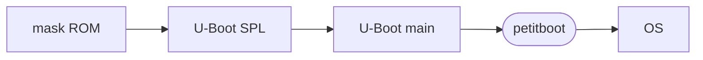

# ODROID boot chain

The [ODROID-N2](https://wiki.odroid.com/odroid-n2/hardware) comes with a SPI
flash as well as a connector for an eMMC flash and an SD card slot. The SoC is
an [Amlogic S922X which can boot from all those storages](https://wiki.odroid.com/odroid-n2/software/boot_sequence),
depending on GPIO configuration and a fallback flow in the mask ROM.
For booting from SPI flash, the ODROID-N2 board has a switch, and comes with
[Petitboot](./petitboot.md) preinstalled[^1].

The SPI flash boot flow is as follows:

- [U-Boot SPL](https://docs.u-boot.org/en/latest/usage/spl_boot.html)
  initializes DRAM and loads U-Boot main ("proper")
- U-Boot main is set up to directly load Linux with Petitboot, which implements
  LinuxBoot

## See also

- [ODROID forum discussion on porting Petitboot to ODROID-N2](
  https://forum.odroid.com/viewtopic.php?f=182&t=33873)

[^1]: <https://wiki.odroid.com/getting_started/petitboot/os_installation_using_otg>
