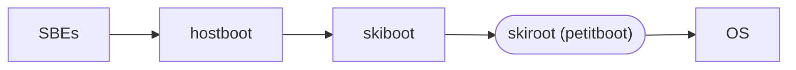

# OpenPOWER boot chain

- [Self-boot engines](https://github.com/open-power/sbe) (SBE) are split
  between an on-chip ROM and an external EEPROM
- [hostboot](https://github.com/open-power/hostboot) is a C++ boot loader that
  does DRAM initialization provides runtime services to skiboot or a hypervisor
- [skiboot](https://github.com/open-power/skiboot) is a C boot loader and
  runtime firmware for OpenPOWER that loads skiroot.

skiroot is a term used to describe the LinuxBoot implementation for OpenPOWER.
A skiroot repository or package does not exist. The term is only used in the
kernel configuration, `skiroot_defconfig`.[^1]

petitboot is a Linux user-space application written in C that calls `kexec`.
The `kexec` installed in the initramfs is not the mainline kexec-tools
implementation, but a smaller implementation named
[kexec-lite](https://github.com/antonblanchard/kexec-lite). It is claimed to be
roughly 32 KB compared to kexec-tools, which is roughly 200 KB.[^2]

[^1]: https://github.com/open-power/op-build/blob/master/openpower/configs/linux/skiroot_defconfig
[^2]: https://github.com/antonblanchard/kexec-lite/issues/4#issuecomment-314936778
